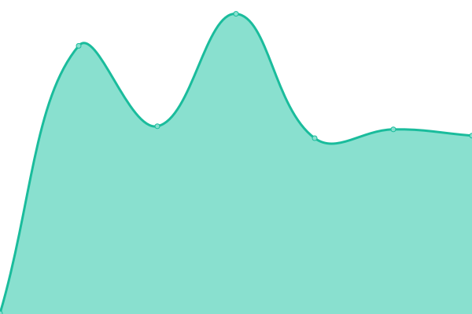
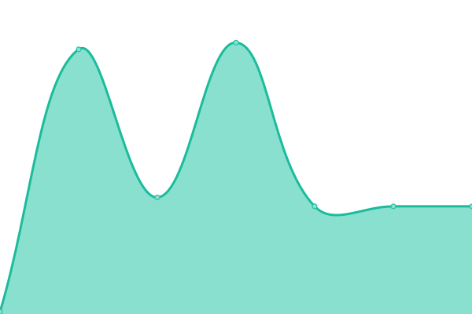

# [📈 Live Status](https://zain-2002.github.io/v1-app-uptime): <!--live status--> **🟩 All systems operational**

This repository contains the open-source uptime monitor and status page for [ZAIN UL ABIDEEN](https://zain-profile.vercel.app), powered by [Upptime](https://github.com/upptime/upptime).

With [Upptime](https://upptime.js.org), you can get your own unlimited and free uptime monitor and status page, powered entirely by a GitHub repository. We use [Issues](https://github.com/zain-2002/v1-app-uptime/issues) as incident reports, [Actions](https://github.com/zain-2002/v1-app-uptime/actions) as uptime monitors, and [Pages](https://zain-2002.github.io/v1-app-uptime) for the status page.

<!--start: status pages-->
<!-- This summary is generated by Upptime (https://github.com/upptime/upptime) -->
<!-- Do not edit this manually, your changes will be overwritten -->
<!-- prettier-ignore -->
| URL | Status | History | Response Time | Uptime |
| --- | ------ | ------- | ------------- | ------ |
|  [ConnectHear Sign-Up API](https://app.connecthear.org/api/v1/customer/sign-up) | 🟩 Up | [connect-hear-sign-up-api.yml](https://github.com/ConnectHear/v1-app-uptime/commits/HEAD/history/connect-hear-sign-up-api.yml) | 

 401ms
     
 | 

<a href="https://ConnectHear.github.io/v1-app-uptime/history/connect-hear-sign-up-api">100.00%</a>
    

|  [ConnectHear Login API](https://app.connecthear.org/api/v1/customer/login) | 🟩 Up | [connect-hear-login-api.yml](https://github.com/ConnectHear/v1-app-uptime/commits/HEAD/history/connect-hear-login-api.yml) | 

 266ms
     
 | 

<a href="https://ConnectHear.github.io/v1-app-uptime/history/connect-hear-login-api">100.00%</a>
    

|  [ConnectHear Google Login API](https://app.connecthear.org/api/v1/customer/google-login) | 🟩 Up | [connect-hear-google-login-api.yml](https://github.com/ConnectHear/v1-app-uptime/commits/HEAD/history/connect-hear-google-login-api.yml) | 

 245ms
     
 | 

<a href="https://ConnectHear.github.io/v1-app-uptime/history/connect-hear-google-login-api">100.00%</a>
    

|  [ConnectHear Forgot Password API](https://app.connecthear.org/api/v1/customer/forgot-password) | 🟩 Up | [connect-hear-forgot-password-api.yml](https://github.com/ConnectHear/v1-app-uptime/commits/HEAD/history/connect-hear-forgot-password-api.yml) | 

 274ms
     
 | 

<a href="https://ConnectHear.github.io/v1-app-uptime/history/connect-hear-forgot-password-api">100.00%</a>
    

|  [ConnectHear Verify Code API](https://app.connecthear.org/api/v1/customer/verify-code) | 🟩 Up | [connect-hear-verify-code-api.yml](https://github.com/ConnectHear/v1-app-uptime/commits/HEAD/history/connect-hear-verify-code-api.yml) | 

 123ms
     
 | 

<a href="https://ConnectHear.github.io/v1-app-uptime/history/connect-hear-verify-code-api">100.00%</a>
    

|  [ConnectHear Verify SMS Code API](https://app.connecthear.org/api/v1/customer/verify-sms-code) | 🟩 Up | [connect-hear-verify-sms-code-api.yml](https://github.com/ConnectHear/v1-app-uptime/commits/HEAD/history/connect-hear-verify-sms-code-api.yml) | 

 97ms
     
 | 

<a href="https://ConnectHear.github.io/v1-app-uptime/history/connect-hear-verify-sms-code-api">100.00%</a>
    

|  [ConnectHear Reset Password API](https://app.connecthear.org/api/v1/customer/reset-password) | 🟩 Up | [connect-hear-reset-password-api.yml](https://github.com/ConnectHear/v1-app-uptime/commits/HEAD/history/connect-hear-reset-password-api.yml) | 

 97ms
     
 | 

<a href="https://ConnectHear.github.io/v1-app-uptime/history/connect-hear-reset-password-api">100.00%</a>
    

|  [ConnectHear Resend OTP API](https://app.connecthear.org/api/v1/customer/resend-otp) | 🟩 Up | [connect-hear-resend-otp-api.yml](https://github.com/ConnectHear/v1-app-uptime/commits/HEAD/history/connect-hear-resend-otp-api.yml) | 

 101ms
     
 | 

<a href="https://ConnectHear.github.io/v1-app-uptime/history/connect-hear-resend-otp-api">100.00%</a>
    

<!--end: status pages-->

[**Visit our status website →**](https://zain-2002.github.io/v1-app-uptime)

## 📄 License

- Powered by: [Upptime](https://github.com/upptime/upptime)
- Code: [MIT](./LICENSE) © [Anand Chowdhary](https://anandchowdhary.com), supported by [Pabio](https://pabio.com)
- Data in the `./history` directory: [Open Database License](https://opendatacommons.org/licenses/odbl/1-0/)
