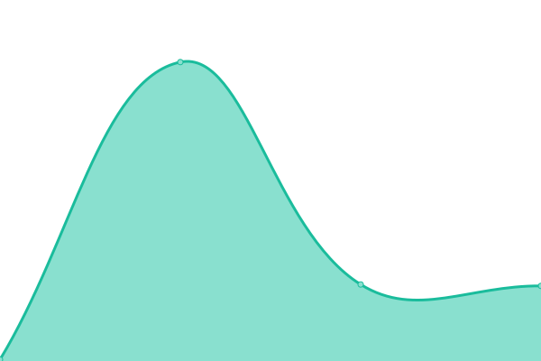

# [📈 Live Status](https://ConnectHear.github.io/v1-app-uptime): <!--live status--> **🟧 Partial outage**

This repository contains the open-source uptime monitor and status page for [ConnectHear](connecthear.org), powered by [Upptime](https://github.com/upptime/upptime).

With [Upptime](https://upptime.js.org), you can get your own unlimited and free uptime monitor and status page, powered entirely by a GitHub repository. We use [Issues](https://github.com/ConnectHear/v1-app-uptime/issues) as incident reports, [Actions](https://github.com/ConnectHear/v1-app-uptime/actions) as uptime monitors, and [Pages](https://ConnectHear.github.io/v1-app-uptime) for the status page.

<!--start: status pages-->
<!-- This summary is generated by Upptime (https://github.com/upptime/upptime) -->
<!-- Do not edit this manually, your changes will be overwritten -->
<!-- prettier-ignore -->
| URL | Status | History | Response Time | Uptime |
| --- | ------ | ------- | ------------- | ------ |
|  [ConnectHear Sign-Up API](https://app.connecthear.org/api/v1/customer/sign-up) | 🟩 Up | [connect-hear-sign-up-api.yml](https://github.com/ConnectHear/v1-app-uptime/commits/HEAD/history/connect-hear-sign-up-api.yml) | 

 344ms
     
 | 

<a href="https://connecthear.github.io/v1-app-uptime/history/connect-hear-sign-up-api">100.00%</a>
    

|  [ConnectHear Login API](https://app.connecthear.org/api/v1/customer/login) | 🟩 Up | [connect-hear-login-api.yml](https://github.com/ConnectHear/v1-app-uptime/commits/HEAD/history/connect-hear-login-api.yml) | 

 237ms
     
 | 

<a href="https://connecthear.github.io/v1-app-uptime/history/connect-hear-login-api">100.00%</a>
    

|  [ConnectHear Google Login API](https://app.connecthear.org/api/v1/customer/google-login) | 🟩 Up | [connect-hear-google-login-api.yml](https://github.com/ConnectHear/v1-app-uptime/commits/HEAD/history/connect-hear-google-login-api.yml) | 

 191ms
     
 | 

<a href="https://connecthear.github.io/v1-app-uptime/history/connect-hear-google-login-api">100.00%</a>
    

|  [ConnectHear Forgot Password API](https://app.connecthear.org/api/v1/customer/forgot-password) | 🟩 Up | [connect-hear-forgot-password-api.yml](https://github.com/ConnectHear/v1-app-uptime/commits/HEAD/history/connect-hear-forgot-password-api.yml) | 

 214ms
     
 | 

<a href="https://connecthear.github.io/v1-app-uptime/history/connect-hear-forgot-password-api">100.00%</a>
    

|  [ConnectHear Verify Code API](https://app.connecthear.org/api/v1/customer/verify-code) | 🟩 Up | [connect-hear-verify-code-api.yml](https://github.com/ConnectHear/v1-app-uptime/commits/HEAD/history/connect-hear-verify-code-api.yml) | 

 100ms
     
 | 

<a href="https://connecthear.github.io/v1-app-uptime/history/connect-hear-verify-code-api">100.00%</a>
    

|  [ConnectHear Verify SMS Code API](https://app.connecthear.org/api/v1/customer/verify-sms-code) | 🟩 Up | [connect-hear-verify-sms-code-api.yml](https://github.com/ConnectHear/v1-app-uptime/commits/HEAD/history/connect-hear-verify-sms-code-api.yml) | 

 76ms
     
 | 

<a href="https://connecthear.github.io/v1-app-uptime/history/connect-hear-verify-sms-code-api">100.00%</a>
    

|  [ConnectHear Reset Password API](https://app.connecthear.org/api/v1/customer/reset-password) | 🟩 Up | [connect-hear-reset-password-api.yml](https://github.com/ConnectHear/v1-app-uptime/commits/HEAD/history/connect-hear-reset-password-api.yml) | 

 73ms
     
 | 

<a href="https://connecthear.github.io/v1-app-uptime/history/connect-hear-reset-password-api">100.00%</a>
    

|  [ConnectHear Resend OTP API](https://app.connecthear.org/api/v1/customer/resend-otp) | 🟩 Up | [connect-hear-resend-otp-api.yml](https://github.com/ConnectHear/v1-app-uptime/commits/HEAD/history/connect-hear-resend-otp-api.yml) | 

 75ms
     
 | 

<a href="https://connecthear.github.io/v1-app-uptime/history/connect-hear-resend-otp-api">100.00%</a>
    

|  [ConnectHear Create Complaint API](https://app.connecthear.org/api/v1/customer/create-complaint) | 🟥 Down | [connect-hear-create-complaint-api.yml](https://github.com/ConnectHear/v1-app-uptime/commits/HEAD/history/connect-hear-create-complaint-api.yml) | 

 146ms
     
 | 

<a href="https://connecthear.github.io/v1-app-uptime/history/connect-hear-create-complaint-api">0.00%</a>
    

|  [ConnectHear Create Video Session API](https://app.connecthear.org/api/v1/customer/create-video-session) | 🟥 Down | [connect-hear-create-video-session-api.yml](https://github.com/ConnectHear/v1-app-uptime/commits/HEAD/history/connect-hear-create-video-session-api.yml) | 

 87ms
     
 | 

<a href="https://connecthear.github.io/v1-app-uptime/history/connect-hear-create-video-session-api">0.05%</a>
    

|  [ConnectHear Get Plans API](https://app.connecthear.org/api/v1/customer/get-plans) | 🟥 Down | [connect-hear-get-plans-api.yml](https://github.com/ConnectHear/v1-app-uptime/commits/HEAD/history/connect-hear-get-plans-api.yml) | 

 94ms
     
 | 

<a href="https://connecthear.github.io/v1-app-uptime/history/connect-hear-get-plans-api">0.00%</a>
    

|  [ConnectHear Update Profile API](https://app.connecthear.org/api/v1/customer/update-profile) | 🟥 Down | [connect-hear-update-profile-api.yml](https://github.com/ConnectHear/v1-app-uptime/commits/HEAD/history/connect-hear-update-profile-api.yml) | 

 80ms
     
 | 

<a href="https://connecthear.github.io/v1-app-uptime/history/connect-hear-update-profile-api">0.03%</a>
    

|  [ConnectHear Make Subscription API](https://app.connecthear.org/api/v1/customer/make-subscription) | 🟥 Down | [connect-hear-make-subscription-api.yml](https://github.com/ConnectHear/v1-app-uptime/commits/HEAD/history/connect-hear-make-subscription-api.yml) | 

 86ms
     
 | 

<a href="https://connecthear.github.io/v1-app-uptime/history/connect-hear-make-subscription-api">0.03%</a>
    

|  [ConnectHear Update Monitoring Session Status API](https://app.connecthear.org/api/v1/customer/update-monitoring-session-status) | 🟥 Down | [connect-hear-update-monitoring-session-status-api.yml](https://github.com/ConnectHear/v1-app-uptime/commits/HEAD/history/connect-hear-update-monitoring-session-status-api.yml) | 

 99ms
     
 | 

<a href="https://connecthear.github.io/v1-app-uptime/history/connect-hear-update-monitoring-session-status-api">0.00%</a>
    

|  [ConnectHear Interpreter Sign-Up API](https://app.connecthear.org/api/v1/interpreter/sign-up) | 🟩 Up | [connect-hear-interpreter-sign-up-api.yml](https://github.com/ConnectHear/v1-app-uptime/commits/HEAD/history/connect-hear-interpreter-sign-up-api.yml) | 

 91ms
     
 | 

<a href="https://connecthear.github.io/v1-app-uptime/history/connect-hear-interpreter-sign-up-api">100.00%</a>
    

|  [ConnectHear Interpreter Verify SMS Code API](https://app.connecthear.org/api/v1/interpreter/verify-sms-code) | 🟩 Up | [connect-hear-interpreter-verify-sms-code-api.yml](https://github.com/ConnectHear/v1-app-uptime/commits/HEAD/history/connect-hear-interpreter-verify-sms-code-api.yml) | 

 59ms
     
 | 

<a href="https://connecthear.github.io/v1-app-uptime/history/connect-hear-interpreter-verify-sms-code-api">100.00%</a>
    

|  [ConnectHear Interpreter Login API](https://app.connecthear.org/api/v1/interpreter/login) | 🟩 Up | [connect-hear-interpreter-login-api.yml](https://github.com/ConnectHear/v1-app-uptime/commits/HEAD/history/connect-hear-interpreter-login-api.yml) | 

 110ms
     
 | 

<a href="https://connecthear.github.io/v1-app-uptime/history/connect-hear-interpreter-login-api">100.00%</a>
    

|  [ConnectHear Interpreter Google Login API](https://app.connecthear.org/api/v1/interpreter/google-login) | 🟩 Up | [connect-hear-interpreter-google-login-api.yml](https://github.com/ConnectHear/v1-app-uptime/commits/HEAD/history/connect-hear-interpreter-google-login-api.yml) | 

 389ms
     
 | 

<a href="https://connecthear.github.io/v1-app-uptime/history/connect-hear-interpreter-google-login-api">100.00%</a>
    

|  [ConnectHear Interpreter Forgot Password API](https://app.connecthear.org/api/v1/interpreter/forgot-password) | 🟩 Up | [connect-hear-interpreter-forgot-password-api.yml](https://github.com/ConnectHear/v1-app-uptime/commits/HEAD/history/connect-hear-interpreter-forgot-password-api.yml) | 

 244ms
     
 | 

<a href="https://connecthear.github.io/v1-app-uptime/history/connect-hear-interpreter-forgot-password-api">100.00%</a>
    

|  [ConnectHear Interpreter Verify Code API](https://app.connecthear.org/api/v1/interpreter/verify-code) | 🟩 Up | [connect-hear-interpreter-verify-code-api.yml](https://github.com/ConnectHear/v1-app-uptime/commits/HEAD/history/connect-hear-interpreter-verify-code-api.yml) | 

 231ms
     
 | 

<a href="https://connecthear.github.io/v1-app-uptime/history/connect-hear-interpreter-verify-code-api">100.00%</a>
    

|  [ConnectHear Interpreter Reset Password API](https://app.connecthear.org/api/v1/interpreter/reset-password) | 🟩 Up | [connect-hear-interpreter-reset-password-api.yml](https://github.com/ConnectHear/v1-app-uptime/commits/HEAD/history/connect-hear-interpreter-reset-password-api.yml) | 

 140ms
     
 | 

<a href="https://connecthear.github.io/v1-app-uptime/history/connect-hear-interpreter-reset-password-api">100.00%</a>
    

|  [ConnectHear Interpreter Files Add API](https://app.connecthear.org/api/v1/interpreter/files-add) | 🟥 Down | [connect-hear-interpreter-files-add-api.yml](https://github.com/ConnectHear/v1-app-uptime/commits/HEAD/history/connect-hear-interpreter-files-add-api.yml) | 

 107ms
     
 | 

<a href="https://connecthear.github.io/v1-app-uptime/history/connect-hear-interpreter-files-add-api">0.03%</a>
    

|  [ConnectHear Interpreter Update Device Token API](https://app.connecthear.org/api/v1/interpreter/update-device-token) | 🟥 Down | [connect-hear-interpreter-update-device-token-api.yml](https://github.com/ConnectHear/v1-app-uptime/commits/HEAD/history/connect-hear-interpreter-update-device-token-api.yml) | 

 103ms
     
 | 

<a href="https://connecthear.github.io/v1-app-uptime/history/connect-hear-interpreter-update-device-token-api">0.04%</a>
    

|  [ConnectHear Interpreter Create Complaint API](https://app.connecthear.org/api/v1/interpreter/create-complaint) | 🟥 Down | [connect-hear-interpreter-create-complaint-api.yml](https://github.com/ConnectHear/v1-app-uptime/commits/HEAD/history/connect-hear-interpreter-create-complaint-api.yml) | 

 82ms
     
 | 

<a href="https://connecthear.github.io/v1-app-uptime/history/connect-hear-interpreter-create-complaint-api">0.00%</a>
    

<!--end: status pages-->

[**Visit our status website →**](https://ConnectHear.github.io/v1-app-uptime)

## 📄 License

- Powered by: [Upptime](https://github.com/upptime/upptime)
- Code: [MIT](./LICENSE) © [Anand Chowdhary](https://anandchowdhary.com), supported by [Pabio](https://pabio.com)
- Data in the `./history` directory: [Open Database License](https://opendatacommons.org/licenses/odbl/1-0/)
