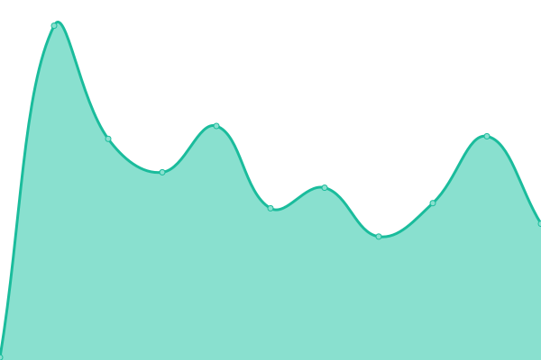
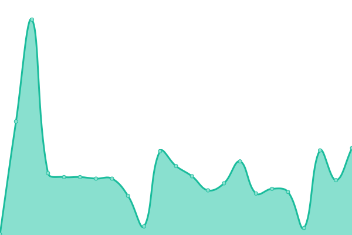

# [📈 Live Status](https://ConnectHear.github.io/v1-app-uptime): <!--live status--> **🟧 Partial outage**

This repository contains the uptime monitor and status page for the ConnectHear Application v1.0.

<!--start: status pages-->
<!-- This summary is generated by Upptime (https://github.com/upptime/upptime) -->
<!-- Do not edit this manually, your changes will be overwritten -->
<!-- prettier-ignore -->
| URL | Status | History | Response Time | Uptime |
| --- | ------ | ------- | ------------- | ------ |
|  [Customer Sign-Up API](https://app.connecthear.org/api/v1/customer/sign-up) | 🟩 Up | [customer-sign-up-api.yml](https://github.com/ConnectHear/v1-app-uptime/commits/HEAD/history/customer-sign-up-api.yml) | 

 591ms
     
 | 

<a href="https://connecthear.github.io/v1-app-uptime/history/customer-sign-up-api">100.00%</a>
    

|  [Customer Login API](https://app.connecthear.org/api/v1/customer/login) | 🟩 Up | [customer-login-api.yml](https://github.com/ConnectHear/v1-app-uptime/commits/HEAD/history/customer-login-api.yml) | 

 448ms
     
 | 

<a href="https://connecthear.github.io/v1-app-uptime/history/customer-login-api">100.00%</a>
    

|  [Customer Google Login API](https://app.connecthear.org/api/v1/customer/google-login) | 🟩 Up | [customer-google-login-api.yml](https://github.com/ConnectHear/v1-app-uptime/commits/HEAD/history/customer-google-login-api.yml) | 

 364ms
     
 | 

<a href="https://connecthear.github.io/v1-app-uptime/history/customer-google-login-api">100.00%</a>
    

|  [Customer Forgot Password API](https://app.connecthear.org/api/v1/customer/forgot-password) | 🟩 Up | [customer-forgot-password-api.yml](https://github.com/ConnectHear/v1-app-uptime/commits/HEAD/history/customer-forgot-password-api.yml) | 

 452ms
     
 | 

<a href="https://connecthear.github.io/v1-app-uptime/history/customer-forgot-password-api">100.00%</a>
    

|  [Customer Code Verification API](https://app.connecthear.org/api/v1/customer/verify-code) | 🟩 Up | [customer-code-verification-api.yml](https://github.com/ConnectHear/v1-app-uptime/commits/HEAD/history/customer-code-verification-api.yml) | 

 54ms
     
 | 

<a href="https://connecthear.github.io/v1-app-uptime/history/customer-code-verification-api">100.00%</a>
    

|  [Customer SMS Code Verification API](https://app.connecthear.org/api/v1/customer/verify-sms-code) | 🟩 Up | [customer-sms-code-verification-api.yml](https://github.com/ConnectHear/v1-app-uptime/commits/HEAD/history/customer-sms-code-verification-api.yml) | 

 78ms
     
 | 

<a href="https://connecthear.github.io/v1-app-uptime/history/customer-sms-code-verification-api">100.00%</a>
    

|  [Customer Password Reset API](https://app.connecthear.org/api/v1/customer/reset-password) | 🟩 Up | [customer-password-reset-api.yml](https://github.com/ConnectHear/v1-app-uptime/commits/HEAD/history/customer-password-reset-api.yml) | 

 186ms
     
 | 

<a href="https://connecthear.github.io/v1-app-uptime/history/customer-password-reset-api">100.00%</a>
    

|  [Customer Resend OTP API](https://app.connecthear.org/api/v1/customer/resend-otp) | 🟩 Up | [customer-resend-otp-api.yml](https://github.com/ConnectHear/v1-app-uptime/commits/HEAD/history/customer-resend-otp-api.yml) | 

 204ms
     
 | 

<a href="https://connecthear.github.io/v1-app-uptime/history/customer-resend-otp-api">100.00%</a>
    

|  [Customer Get Profile API](https://app.connecthear.org/api/v1/customer/get-profile) | 🟥 Down | [customer-get-profile-api.yml](https://github.com/ConnectHear/v1-app-uptime/commits/HEAD/history/customer-get-profile-api.yml) | 

 157ms
     
 | 

<a href="https://connecthear.github.io/v1-app-uptime/history/customer-get-profile-api">3.46%</a>
    

|  [Customer Change Password API](https://app.connecthear.org/api/v1/customer/change-password) | 🟥 Down | [customer-change-password-api.yml](https://github.com/ConnectHear/v1-app-uptime/commits/HEAD/history/customer-change-password-api.yml) | 

 84ms
     
 | 

<a href="https://connecthear.github.io/v1-app-uptime/history/customer-change-password-api">3.46%</a>
    

|  [Customer Update Device Token API](https://app.connecthear.org/api/v1/customer/update-device-token) | 🟥 Down | [customer-update-device-token-api.yml](https://github.com/ConnectHear/v1-app-uptime/commits/HEAD/history/customer-update-device-token-api.yml) | 

 81ms
     
 | 

<a href="https://connecthear.github.io/v1-app-uptime/history/customer-update-device-token-api">3.46%</a>
    

<!--end: status pages-->

[**Visit our status website →**](https://ConnectHear.github.io/v1-app-uptime)
