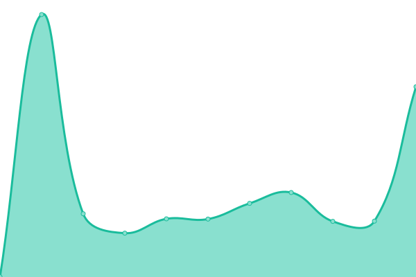
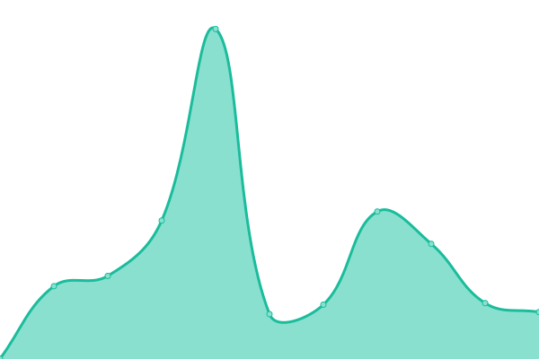
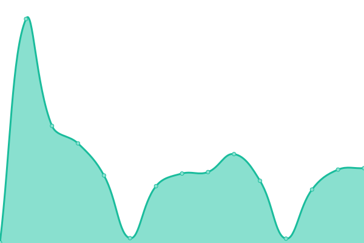
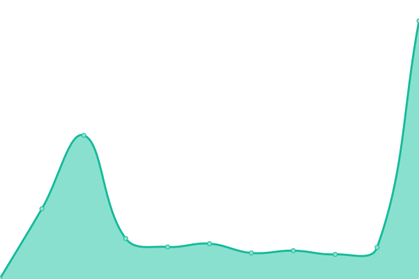

# [📈 Live Status](https://ConnectHear.github.io/v1-app-uptime): <!--live status--> **🟧 Partial outage**

This repository contains the uptime monitor and status page for the ConnectHear Application v1.0.

<!--start: status pages-->
<!-- This summary is generated by Upptime (https://github.com/upptime/upptime) -->
<!-- Do not edit this manually, your changes will be overwritten -->
<!-- prettier-ignore -->
| URL | Status | History | Response Time | Uptime |
| --- | ------ | ------- | ------------- | ------ |
|  [Customer Sign-Up API](https://app.connecthear.org/api/v1/customer/sign-up) | 🟩 Up | [customer-sign-up-api.yml](https://github.com/ConnectHear/v1-app-uptime/commits/HEAD/history/customer-sign-up-api.yml) | 

 463ms
     
 | 

<a href="https://connecthear.github.io/v1-app-uptime/history/customer-sign-up-api">100.00%</a>
    

|  [Customer Login API](https://app.connecthear.org/api/v1/customer/login) | 🟩 Up | [customer-login-api.yml](https://github.com/ConnectHear/v1-app-uptime/commits/HEAD/history/customer-login-api.yml) | 

 307ms
     
 | 

<a href="https://connecthear.github.io/v1-app-uptime/history/customer-login-api">100.00%</a>
    

|  [Customer Google Login API](https://app.connecthear.org/api/v1/customer/google-login) | 🟩 Up | [customer-google-login-api.yml](https://github.com/ConnectHear/v1-app-uptime/commits/HEAD/history/customer-google-login-api.yml) | 

 287ms
     
 | 

<a href="https://connecthear.github.io/v1-app-uptime/history/customer-google-login-api">98.07%</a>
    

|  [Customer Forgot Password API](https://app.connecthear.org/api/v1/customer/forgot-password) | 🟩 Up | [customer-forgot-password-api.yml](https://github.com/ConnectHear/v1-app-uptime/commits/HEAD/history/customer-forgot-password-api.yml) | 

 321ms
     
 | 

<a href="https://connecthear.github.io/v1-app-uptime/history/customer-forgot-password-api">0.58%</a>
    

|  [Customer Code Verification API](https://app.connecthear.org/api/v1/customer/verify-code) | 🟩 Up | [customer-code-verification-api.yml](https://github.com/ConnectHear/v1-app-uptime/commits/HEAD/history/customer-code-verification-api.yml) | 

 66ms
     
 | 

<a href="https://connecthear.github.io/v1-app-uptime/history/customer-code-verification-api">100.00%</a>
    

|  [Customer Get Profile API](https://app.connecthear.org/api/v1/customer/get-profile) | 🟥 Down | [customer-get-profile-api.yml](https://github.com/ConnectHear/v1-app-uptime/commits/HEAD/history/customer-get-profile-api.yml) | 

 207ms
     
 | 

<a href="https://connecthear.github.io/v1-app-uptime/history/customer-get-profile-api">0.00%</a>
    

|  [Customer Update Device Token API](https://app.connecthear.org/api/v1/customer/update-device-token) | 🟥 Down | [customer-update-device-token-api.yml](https://github.com/ConnectHear/v1-app-uptime/commits/HEAD/history/customer-update-device-token-api.yml) | 

 105ms
     
 | 

<a href="https://connecthear.github.io/v1-app-uptime/history/customer-update-device-token-api">0.00%</a>
    

|  [Interpreter Sign-Up API](https://app.connecthear.org/api/v1/interpreter/sign-up) | 🟩 Up | [interpreter-sign-up-api.yml](https://github.com/ConnectHear/v1-app-uptime/commits/HEAD/history/interpreter-sign-up-api.yml) | 

 117ms
     
 | 

<a href="https://connecthear.github.io/v1-app-uptime/history/interpreter-sign-up-api">99.44%</a>
    

|  [Interpreter Google Login API](https://app.connecthear.org/api/v1/interpreter/google-login) | 🟩 Up | [interpreter-google-login-api.yml](https://github.com/ConnectHear/v1-app-uptime/commits/HEAD/history/interpreter-google-login-api.yml) | 

 157ms
     
 | 

<a href="https://connecthear.github.io/v1-app-uptime/history/interpreter-google-login-api">72.65%</a>
    

<!--end: status pages-->

[**Visit our status website →**](https://ConnectHear.github.io/v1-app-uptime)
