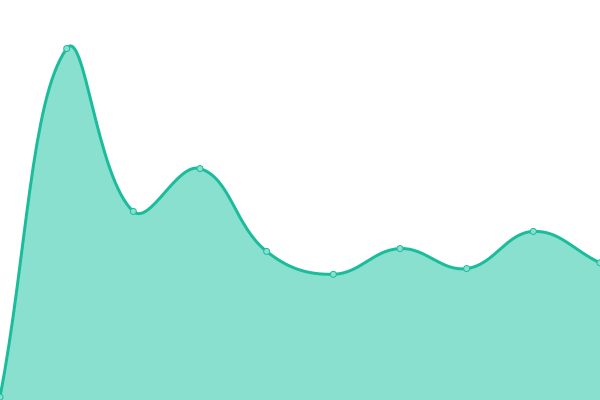
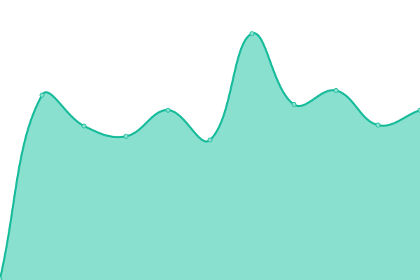
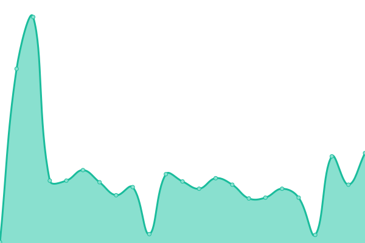
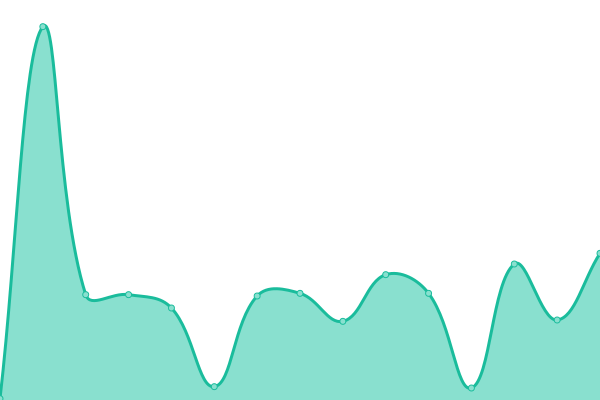
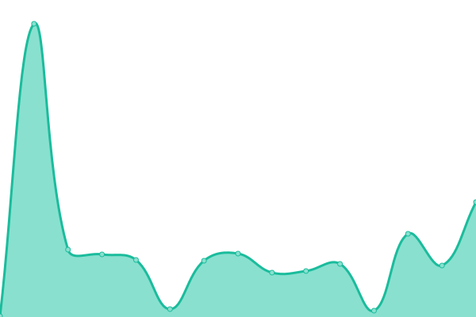
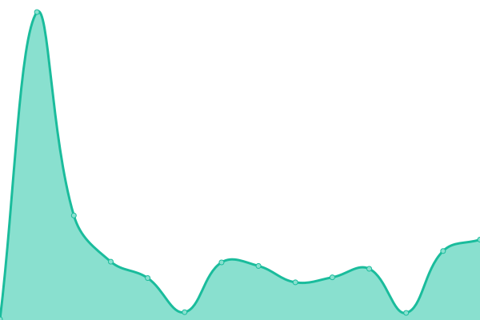
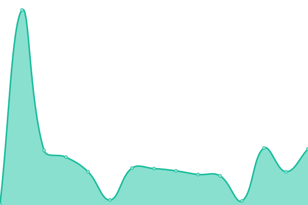
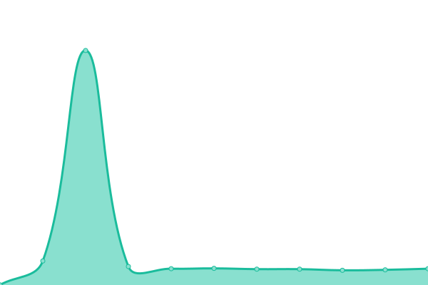
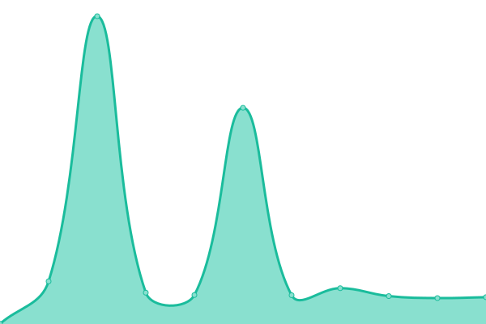
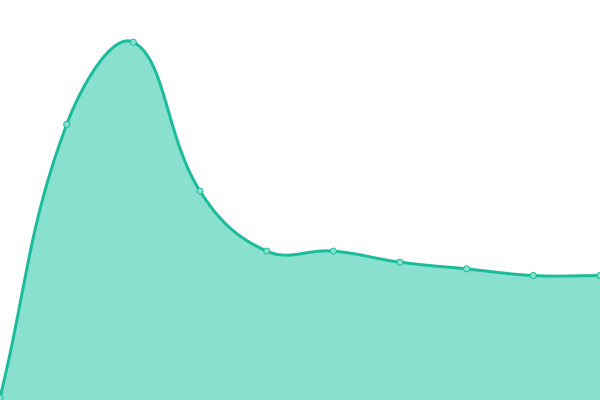

# [📈 Live Status](https://ConnectHear.github.io/v1-app-uptime): <!--live status--> **🟧 Partial outage**

This repository contains the uptime monitor and status page for the ConnectHear Application v1.0.

<!--start: status pages-->
<!-- This summary is generated by Upptime (https://github.com/upptime/upptime) -->
<!-- Do not edit this manually, your changes will be overwritten -->
<!-- prettier-ignore -->
| URL | Status | History | Response Time | Uptime |
| --- | ------ | ------- | ------------- | ------ |
|  [Customer Sign-Up API](https://app.connecthear.org/api/v1/customer/sign-up) | 🟩 Up | [customer-sign-up-api.yml](https://github.com/ConnectHear/v1-app-uptime/commits/HEAD/history/customer-sign-up-api.yml) | 

 823ms
     
 | 

<a href="https://connecthear.github.io/v1-app-uptime/history/customer-sign-up-api">98.88%</a>
    

|  [Customer Login API](https://app.connecthear.org/api/v1/customer/login) | 🟩 Up | [customer-login-api.yml](https://github.com/ConnectHear/v1-app-uptime/commits/HEAD/history/customer-login-api.yml) | 

 1738ms
     
 | 

<a href="https://connecthear.github.io/v1-app-uptime/history/customer-login-api">98.89%</a>
    

|  [Customer Google Login API](https://app.connecthear.org/api/v1/customer/google-login) | 🟩 Up | [customer-google-login-api.yml](https://github.com/ConnectHear/v1-app-uptime/commits/HEAD/history/customer-google-login-api.yml) | 

 847ms
     
 | 

<a href="https://connecthear.github.io/v1-app-uptime/history/customer-google-login-api">98.85%</a>
    

|  [Customer Forgot Password API](https://app.connecthear.org/api/v1/customer/forgot-password) | 🟩 Up | [customer-forgot-password-api.yml](https://github.com/ConnectHear/v1-app-uptime/commits/HEAD/history/customer-forgot-password-api.yml) | 

 1095ms
     
 | 

<a href="https://connecthear.github.io/v1-app-uptime/history/customer-forgot-password-api">98.86%</a>
    

|  [Customer Code Verfication API](https://app.connecthear.org/api/v1/customer/verify-code) | 🟩 Up | [customer-code-verfication-api.yml](https://github.com/ConnectHear/v1-app-uptime/commits/HEAD/history/customer-code-verfication-api.yml) | 

 144ms
     
 | 

<a href="https://connecthear.github.io/v1-app-uptime/history/customer-code-verfication-api">98.51%</a>
    

|  [Customer sms Code Verification API](https://app.connecthear.org/api/v1/customer/verify-sms-code) | 🟩 Up | [customer-sms-code-verification-api.yml](https://github.com/ConnectHear/v1-app-uptime/commits/HEAD/history/customer-sms-code-verification-api.yml) | 

 425ms
     
 | 

<a href="https://connecthear.github.io/v1-app-uptime/history/customer-sms-code-verification-api">98.92%</a>
    

|  [Customer Password Reset API](https://app.connecthear.org/api/v1/customer/reset-password) | 🟩 Up | [customer-password-reset-api.yml](https://github.com/ConnectHear/v1-app-uptime/commits/HEAD/history/customer-password-reset-api.yml) | 

 573ms
     
 | 

<a href="https://connecthear.github.io/v1-app-uptime/history/customer-password-reset-api">98.95%</a>
    

|  [Customer Resend OTP API](https://app.connecthear.org/api/v1/customer/resend-otp) | 🟩 Up | [customer-resend-otp-api.yml](https://github.com/ConnectHear/v1-app-uptime/commits/HEAD/history/customer-resend-otp-api.yml) | 

 971ms
     
 | 

<a href="https://connecthear.github.io/v1-app-uptime/history/customer-resend-otp-api">98.96%</a>
    

|  [Customer Get Profile API](https://app.connecthear.org/api/v1/customer/get-profile) | 🟥 Down | [customer-get-profile-api.yml](https://github.com/ConnectHear/v1-app-uptime/commits/HEAD/history/customer-get-profile-api.yml) | 

 190ms
     
 | 

<a href="https://connecthear.github.io/v1-app-uptime/history/customer-get-profile-api">84.60%</a>
    

|  [Customer Update Device Token API](https://app.connecthear.org/api/v1/customer/update-device-token) | 🟥 Down | [customer-update-device-token-api.yml](https://github.com/ConnectHear/v1-app-uptime/commits/HEAD/history/customer-update-device-token-api.yml) | 

 78ms
     
 | 

<a href="https://connecthear.github.io/v1-app-uptime/history/customer-update-device-token-api">84.60%</a>
    

|  [Customer Change Password API](https://app.connecthear.org/api/v1/customer/change-password) | 🟥 Down | [customer-change-password-api.yml](https://github.com/ConnectHear/v1-app-uptime/commits/HEAD/history/customer-change-password-api.yml) | 

 76ms
     
 | 

<a href="https://connecthear.github.io/v1-app-uptime/history/customer-change-password-api">84.60%</a>
    

|  [Customer Update Device Token API](https://app.connecthear.org/api/v1/customer/update-device-token) | 🟥 Down | [customer-update-device-token-api.yml](https://github.com/ConnectHear/v1-app-uptime/commits/HEAD/history/customer-update-device-token-api.yml) | 

 78ms
     
 | 

<a href="https://connecthear.github.io/v1-app-uptime/history/customer-update-device-token-api">84.60%</a>
    

|  [Customer Change Password API](https://app.connecthear.org/api/v1/customer/change-password) | 🟥 Down | [customer-change-password-api.yml](https://github.com/ConnectHear/v1-app-uptime/commits/HEAD/history/customer-change-password-api.yml) | 

 76ms
     
 | 

<a href="https://connecthear.github.io/v1-app-uptime/history/customer-change-password-api">84.60%</a>
    

|  [Customer Files Add API](https://app.connecthear.org/api/v1/customer/files-add) | 🟥 Down | [customer-files-add-api.yml](https://github.com/ConnectHear/v1-app-uptime/commits/HEAD/history/customer-files-add-api.yml) | 

 76ms
     
 | 

<a href="https://connecthear.github.io/v1-app-uptime/history/customer-files-add-api">84.60%</a>
    

|  [Customer Add Reviews API](https://app.connecthear.org/api/v1/customer/add-reviews) | 🟥 Down | [customer-add-reviews-api.yml](https://github.com/ConnectHear/v1-app-uptime/commits/HEAD/history/customer-add-reviews-api.yml) | 

 72ms
     
 | 

<a href="https://connecthear.github.io/v1-app-uptime/history/customer-add-reviews-api">84.60%</a>
    

|  [Customer Complaint API](https://app.connecthear.org/api/v1/customer/create-complaint) | 🟥 Down | [customer-complaint-api.yml](https://github.com/ConnectHear/v1-app-uptime/commits/HEAD/history/customer-complaint-api.yml) | 

 79ms
     
 | 

<a href="https://connecthear.github.io/v1-app-uptime/history/customer-complaint-api">84.60%</a>
    

|  [Customer Create Video Session API](https://app.connecthear.org/api/v1/customer/create-video-session) | 🟥 Down | [customer-create-video-session-api.yml](https://github.com/ConnectHear/v1-app-uptime/commits/HEAD/history/customer-create-video-session-api.yml) | 

 79ms
     
 | 

<a href="https://connecthear.github.io/v1-app-uptime/history/customer-create-video-session-api">84.60%</a>
    

|  [Customer Create Call API](https://app.connecthear.org/api/v1/customer/create-call) | 🟥 Down | [customer-create-call-api.yml](https://github.com/ConnectHear/v1-app-uptime/commits/HEAD/history/customer-create-call-api.yml) | 

 108ms
     
 | 

<a href="https://connecthear.github.io/v1-app-uptime/history/customer-create-call-api">84.60%</a>
    

|  [ConnectHear Get Reviews API](https://app.connecthear.org/api/v1/customer/get-reviews) | 🟥 Down | [connect-hear-get-reviews-api.yml](https://github.com/ConnectHear/v1-app-uptime/commits/HEAD/history/connect-hear-get-reviews-api.yml) | 

 77ms
     
 | 

<a href="https://connecthear.github.io/v1-app-uptime/history/connect-hear-get-reviews-api">84.60%</a>
    

|  [Customer Plans API](https://app.connecthear.org/api/v1/customer/get-plans) | 🟥 Down | [customer-plans-api.yml](https://github.com/ConnectHear/v1-app-uptime/commits/HEAD/history/customer-plans-api.yml) | 

 74ms
     
 | 

<a href="https://connecthear.github.io/v1-app-uptime/history/customer-plans-api">84.60%</a>
    

|  [Customer Update Profile API](https://app.connecthear.org/api/v1/customer/update-profile) | 🟥 Down | [customer-update-profile-api.yml](https://github.com/ConnectHear/v1-app-uptime/commits/HEAD/history/customer-update-profile-api.yml) | 

 81ms
     
 | 

<a href="https://connecthear.github.io/v1-app-uptime/history/customer-update-profile-api">84.60%</a>
    

|  [Customer Subscription API](https://app.connecthear.org/api/v1/customer/make-subscription) | 🟥 Down | [customer-subscription-api.yml](https://github.com/ConnectHear/v1-app-uptime/commits/HEAD/history/customer-subscription-api.yml) | 

 72ms
     
 | 

<a href="https://connecthear.github.io/v1-app-uptime/history/customer-subscription-api">84.60%</a>
    

|  [Customer Update Monitoring Session Status API](https://app.connecthear.org/api/v1/customer/update-monitoring-session-status) | 🟥 Down | [customer-update-monitoring-session-status-api.yml](https://github.com/ConnectHear/v1-app-uptime/commits/HEAD/history/customer-update-monitoring-session-status-api.yml) | 

 93ms
     
 | 

<a href="https://connecthear.github.io/v1-app-uptime/history/customer-update-monitoring-session-status-api">84.60%</a>
    

|  [Customer Get Call Logs API](https://app.connecthear.org/api/v1/customer/get-call-logs) | 🟥 Down | [customer-get-call-logs-api.yml](https://github.com/ConnectHear/v1-app-uptime/commits/HEAD/history/customer-get-call-logs-api.yml) | 

 72ms
     
 | 

<a href="https://connecthear.github.io/v1-app-uptime/history/customer-get-call-logs-api">84.60%</a>
    

|  [Interpreter Sign-Up API](https://app.connecthear.org/api/v1/interpreter/sign-up) | 🟩 Up | [interpreter-sign-up-api.yml](https://github.com/ConnectHear/v1-app-uptime/commits/HEAD/history/interpreter-sign-up-api.yml) | 

 68ms
     
 | 

<a href="https://connecthear.github.io/v1-app-uptime/history/interpreter-sign-up-api">99.43%</a>
    

|  [Interpreter Verify SMS Code API](https://app.connecthear.org/api/v1/interpreter/verify-sms-code) | 🟩 Up | [interpreter-verify-sms-code-api.yml](https://github.com/ConnectHear/v1-app-uptime/commits/HEAD/history/interpreter-verify-sms-code-api.yml) | 

 889ms
     
 | 

<a href="https://connecthear.github.io/v1-app-uptime/history/interpreter-verify-sms-code-api">99.27%</a>
    

|  [Interpreter Login API](https://app.connecthear.org/api/v1/interpreter/login) | 🟩 Up | [interpreter-login-api.yml](https://github.com/ConnectHear/v1-app-uptime/commits/HEAD/history/interpreter-login-api.yml) | 

 450ms
     
 | 

<a href="https://connecthear.github.io/v1-app-uptime/history/interpreter-login-api">99.29%</a>
    

|  [Interpreter Google Login API](https://app.connecthear.org/api/v1/interpreter/google-login) | 🟩 Up | [interpreter-google-login-api.yml](https://github.com/ConnectHear/v1-app-uptime/commits/HEAD/history/interpreter-google-login-api.yml) | 

 1891ms
     
 | 

<a href="https://connecthear.github.io/v1-app-uptime/history/interpreter-google-login-api">99.45%</a>
    

|  [Interpreter Forgot Password API](https://app.connecthear.org/api/v1/interpreter/forgot-password) | 🟩 Up | [interpreter-forgot-password-api.yml](https://github.com/ConnectHear/v1-app-uptime/commits/HEAD/history/interpreter-forgot-password-api.yml) | 

 447ms
     
 | 

<a href="https://connecthear.github.io/v1-app-uptime/history/interpreter-forgot-password-api">99.45%</a>
    

|  [Interpreter Verify Code API](https://app.connecthear.org/api/v1/interpreter/verify-code) | 🟩 Up | [interpreter-verify-code-api.yml](https://github.com/ConnectHear/v1-app-uptime/commits/HEAD/history/interpreter-verify-code-api.yml) | 

 271ms
     
 | 

<a href="https://connecthear.github.io/v1-app-uptime/history/interpreter-verify-code-api">99.13%</a>
    

|  [Interpreter Reset Password API](https://app.connecthear.org/api/v1/interpreter/reset-password) | 🟩 Up | [interpreter-reset-password-api.yml](https://github.com/ConnectHear/v1-app-uptime/commits/HEAD/history/interpreter-reset-password-api.yml) | 

 397ms
     
 | 

<a href="https://connecthear.github.io/v1-app-uptime/history/interpreter-reset-password-api">98.91%</a>
    

<!--end: status pages-->

[**Visit our status website →**](https://ConnectHear.github.io/v1-app-uptime)
