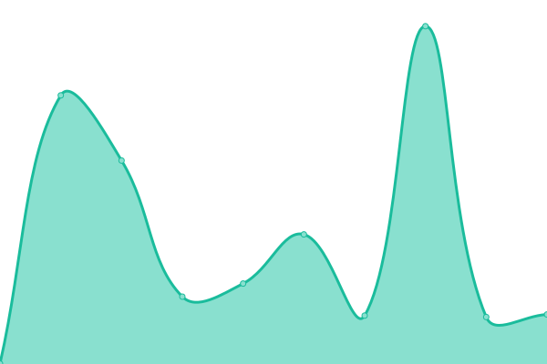

# [📈 Live Status](https://ConnectHear.github.io/v1-app-uptime): <!--live status--> **🟩 All systems operational**

This repository contains the uptime monitor and status page for the ConnectHear Application v1.0.

<!--start: status pages-->
<!-- This summary is generated by Upptime (https://github.com/upptime/upptime) -->
<!-- Do not edit this manually, your changes will be overwritten -->
<!-- prettier-ignore -->
| URL | Status | History | Response Time | Uptime |
| --- | ------ | ------- | ------------- | ------ |
|  [Customer Sign-Up API](https://app.connecthear.org/api/v1/customer/sign-up) | 🟩 Up | [customer-sign-up-api.yml](https://github.com/ConnectHear/v1-app-uptime/commits/HEAD/history/customer-sign-up-api.yml) | 

 402ms
     
 | 

<a href="https://connecthear.github.io/v1-app-uptime/history/customer-sign-up-api">100.00%</a>
    

|  [Customer Login API](https://app.connecthear.org/api/v1/customer/login) | 🟩 Up | [customer-login-api.yml](https://github.com/ConnectHear/v1-app-uptime/commits/HEAD/history/customer-login-api.yml) | 

 400ms
     
 | 

<a href="https://connecthear.github.io/v1-app-uptime/history/customer-login-api">100.00%</a>
    

|  [Customer Google Login API](https://app.connecthear.org/api/v1/customer/google-login) | 🟩 Up | [customer-google-login-api.yml](https://github.com/ConnectHear/v1-app-uptime/commits/HEAD/history/customer-google-login-api.yml) | 

 217ms
     
 | 

<a href="https://connecthear.github.io/v1-app-uptime/history/customer-google-login-api">100.00%</a>
    

|  [Customer Forgot Password API](https://app.connecthear.org/api/v1/customer/forgot-password) | 🟩 Up | [customer-forgot-password-api.yml](https://github.com/ConnectHear/v1-app-uptime/commits/HEAD/history/customer-forgot-password-api.yml) | 

 354ms
     
 | 

<a href="https://connecthear.github.io/v1-app-uptime/history/customer-forgot-password-api">43.85%</a>
    

|  [Customer Code Verfication API](https://app.connecthear.org/api/v1/customer/verify-code) | 🟩 Up | [customer-code-verfication-api.yml](https://github.com/ConnectHear/v1-app-uptime/commits/HEAD/history/customer-code-verfication-api.yml) | 

 83ms
     
 | 

<a href="https://connecthear.github.io/v1-app-uptime/history/customer-code-verfication-api">100.00%</a>
    

|  [Customer sms Code Verification API](https://app.connecthear.org/api/v1/customer/verify-sms-code) | 🟩 Up | [customer-sms-code-verification-api.yml](https://github.com/ConnectHear/v1-app-uptime/commits/HEAD/history/customer-sms-code-verification-api.yml) | 

 68ms
     
 | 

<a href="https://connecthear.github.io/v1-app-uptime/history/customer-sms-code-verification-api">100.00%</a>
    

|  [Customer Password Reset API](https://app.connecthear.org/api/v1/customer/reset-password) | 🟩 Up | [customer-password-reset-api.yml](https://github.com/ConnectHear/v1-app-uptime/commits/HEAD/history/customer-password-reset-api.yml) | 

 68ms
     
 | 

<a href="https://connecthear.github.io/v1-app-uptime/history/customer-password-reset-api">100.00%</a>
    

|  [Customer Resend OTP API](https://app.connecthear.org/api/v1/customer/resend-otp) | 🟩 Up | [customer-resend-otp-api.yml](https://github.com/ConnectHear/v1-app-uptime/commits/HEAD/history/customer-resend-otp-api.yml) | 

 64ms
     
 | 

<a href="https://connecthear.github.io/v1-app-uptime/history/customer-resend-otp-api">100.00%</a>
    

|  [Interpreter Sign-Up API](https://app.connecthear.org/api/v1/interpreter/sign-up) | 🟩 Up | [interpreter-sign-up-api.yml](https://github.com/ConnectHear/v1-app-uptime/commits/HEAD/history/interpreter-sign-up-api.yml) | 

 88ms
     
 | 

<a href="https://connecthear.github.io/v1-app-uptime/history/interpreter-sign-up-api">100.00%</a>
    

|  [Interpreter Verify SMS Code API](https://app.connecthear.org/api/v1/interpreter/verify-sms-code) | 🟩 Up | [interpreter-verify-sms-code-api.yml](https://github.com/ConnectHear/v1-app-uptime/commits/HEAD/history/interpreter-verify-sms-code-api.yml) | 

 153ms
     
 | 

<a href="https://connecthear.github.io/v1-app-uptime/history/interpreter-verify-sms-code-api">100.00%</a>
    

|  [Interpreter Login API](https://app.connecthear.org/api/v1/interpreter/login) | 🟩 Up | [interpreter-login-api.yml](https://github.com/ConnectHear/v1-app-uptime/commits/HEAD/history/interpreter-login-api.yml) | 

 151ms
     
 | 

<a href="https://connecthear.github.io/v1-app-uptime/history/interpreter-login-api">100.00%</a>
    

|  [Interpreter Google Login API](https://app.connecthear.org/api/v1/interpreter/google-login) | 🟩 Up | [interpreter-google-login-api.yml](https://github.com/ConnectHear/v1-app-uptime/commits/HEAD/history/interpreter-google-login-api.yml) | 

 129ms
     
 | 

<a href="https://connecthear.github.io/v1-app-uptime/history/interpreter-google-login-api">100.00%</a>
    

|  [Interpreter Forgot Password API](https://app.connecthear.org/api/v1/interpreter/forgot-password) | 🟩 Up | [interpreter-forgot-password-api.yml](https://github.com/ConnectHear/v1-app-uptime/commits/HEAD/history/interpreter-forgot-password-api.yml) | 

 212ms
     
 | 

<a href="https://connecthear.github.io/v1-app-uptime/history/interpreter-forgot-password-api">42.89%</a>
    

|  [Interpreter Verify Code API](https://app.connecthear.org/api/v1/interpreter/verify-code) | 🟩 Up | [interpreter-verify-code-api.yml](https://github.com/ConnectHear/v1-app-uptime/commits/HEAD/history/interpreter-verify-code-api.yml) | 

 79ms
     
 | 

<a href="https://connecthear.github.io/v1-app-uptime/history/interpreter-verify-code-api">100.00%</a>
    

|  [Interpreter Reset Password API](https://app.connecthear.org/api/v1/interpreter/reset-password) | 🟩 Up | [interpreter-reset-password-api.yml](https://github.com/ConnectHear/v1-app-uptime/commits/HEAD/history/interpreter-reset-password-api.yml) | 

 221ms
     
 | 

<a href="https://connecthear.github.io/v1-app-uptime/history/interpreter-reset-password-api">100.00%</a>
    

<!--end: status pages-->

[**Visit our status website →**](https://ConnectHear.github.io/v1-app-uptime)
